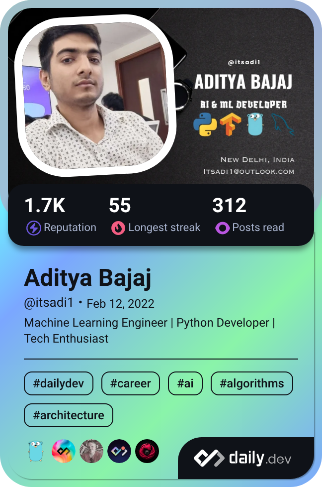
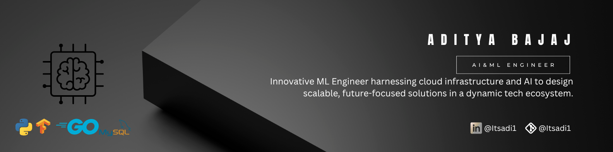

<table align="center" width="100%"">
  <tr>
    <td colspan="2" align="center" style="padding-bottom: 24px;">
      <h1 align="center" style="font-size:1.5em;">
        Hey there, I'm 
      </h1>
      
ADITYA BAJAJ

    </td>
  </tr>
  <tr width:30%>
    <td align="center" valign="middle" style="width:340px; padding-right: 24px;">
      
    </td>
    <td align="center" valign="middle" style="padding-left: 24px;">
      
    </td>
  </tr>
</table>

---

### 🧑‍🎓 About Me

🎓 I'm an undergraduate student passionate about **technology and innovation**.  
💡 My core interest lies in **Python programming**, where I enjoy solving challenges and building robust solutions.

🌐 I actively explore areas like:
- 💻 **Machine Learning Development** – Turning complexities to simplicities.  
- 🤖 **Artificial Intelligence** – learning, experimenting, and creating with **ML** and **NLP**  
- 🛠️ **Problem Solving** – applying logic and algorithms to real-world tasks  

I love collaborating on meaningful projects and continuously expanding my skills across modern development stacks.

---

### 🌐 Find Me Around the Web

---

### ⚡ Fun Facts About Me

- 🧠 I solve coding problems daily to keep my brain sharp  
- 🖥️ I'm constantly tweaking my personal projects to make them better  
- ☕ Coffee + Code = Perfect Combo  
- 💬 Ask me about Java or web app design  

---

